# CI/CD Demo

This repository is a simple Node.js-based CI/CD demo that uses GitHub Actions, Docker, and a Docker Hub-style image push workflow.

## Project structure

- `src/index.js` prints a demo status object.
- `src/calc.js` contains basic arithmetic functions.
- `test/calc.test.js` contains tests for the arithmetic helpers.
- `Dockerfile` builds a small Node.js runtime image.
- `.github/workflows/ci.yml` runs the CI pipeline for source validation.
- `.github/workflows/docker-ci.yml` builds and smokes the Docker image.
- `.github/workflows/deploy.yml` runs a deployment job after a successful CI workflow.
- `.github/workflows/docker-deploy.yml` demonstrates a Docker Hub login and image push workflow using GitHub secrets.

## Local commands

```bash
npm ci
npm test
npm run lint
npm start
npm run build
docker build -t cicd-demo:latest .
docker run --rm cicd-demo:latest
```

## GitHub Actions workflow

The main CI workflow runs on pushes and pull requests to the `main` branch. It installs dependencies with `npm ci`, lints the code, executes tests, builds the project output, and uploads the generated `dist/demo-output.json` artifact for each tested Node version.

The Docker workflow runs the same source validation and then builds a Docker image locally with `docker build`. It also runs a smoke test using `docker run`.

The deployment workflows use `workflow_run` to trigger after a successful CI workflow result and also allow `workflow_dispatch` for manual deployment. In a real project it would deploy to a hosting provider or package registry. For the Docker example, the deployment workflow demonstrates a Docker Hub login and image push using a GitHub repository variable for the username and a repository secret for the Docker Hub access token.

### Docker Hub configuration

Create a GitHub repository variable named `DOCKERHUB_USERNAME` and set it to your Docker Hub username, such as `connectwithravi`.

Create a GitHub repository secret named `DOCKERHUB_TOKEN` and store a valid Docker Hub access token generated from the same Docker Hub account. The token should never be committed in the repository files.

The push target image becomes `connectwithravi/cicd-demo:latest` if the `DOCKERHUB_USERNAME` variable is set to `connectwithravi`.

### How to generate a Docker Hub token

1. Sign in to Docker Hub at https://hub.docker.com.
2. Open your account settings or security page.
3. Choose the option to create an access token.
4. Give the token a name such as `github-actions-demo`.
5. Copy the generated token value and save it securely.
6. In the GitHub repository, go to `Settings → Secrets and variables → Actions`.
7. Create or update the repository secret `DOCKERHUB_TOKEN` with the copied value.
8. Create or update the repository variable `DOCKERHUB_USERNAME` with your Docker Hub username.

Use an access token instead of your Docker Hub password. Access tokens are safer because they can be revoked independently and are meant for automation systems such as GitHub Actions.

## What happens when code changes are merged?

1. A contributor opens a pull request or pushes code to `main`.
2. GitHub Actions starts the `CI` workflow automatically.
3. The workflow checks out the repository, sets up multiple Node.js versions, installs dependencies with `npm ci`, runs `npm run lint`, runs `npm test`, and creates the demo output file in `dist/demo-output.json`.
4. The workflow uploads the generated artifact so the team can inspect the output directly from the Actions run.
5. The Docker CI workflow builds the image and runs it locally to provide a quick smoke test.
6. If all steps succeed, the pull request can be merged or the push can proceed to the next delivery stage.
7. The Docker deploy workflow can log in to Docker Hub using GitHub secrets and push the image to a private or public registry namespace.

## What GitHub Actions does here

GitHub Actions is the automation engine that watches repository events such as `push`, `pull_request`, `workflow_run`, and manual triggers. In this demo, it runs a Node.js matrix CI test, creates a reproducible build artifact, uploads that artifact, builds a Docker image, runs a smoke test inside the container, and then triggers a Docker registry workflow that can push an image to Docker Hub.

## CI/CD flow diagram

```mermaid
flowchart LR
    A[Push or Pull Request to main] --> B[GitHub Actions: CI Workflow]
    B --> C[Checkout Code]
    C --> D[Setup Node.js]
    D --> E[npm ci]
    E --> F[Linter]
    F --> G[Test Suite]
    G --> H[Build demo output]
    H --> I[Upload dist/demo-output.json artifact]
    I --> J[Docker CI Workflow]
    J --> K[Build Docker image]
    K --> L[Run container smoke test]
    L --> M[Docker Deploy Workflow]
    M --> N[Docker Hub login and image push]
```



## How students can read this repo

1. Start with the app in `src/index.js` and `src/calc.js`.
2. Read the test file in `test/calc.test.js`.
3. Open the source CI workflow in `.github/workflows/ci.yml`.
4. Open the Docker CI workflow in `.github/workflows/docker-ci.yml`.
5. Open the Docker Hub image workflow in `.github/workflows/docker-deploy.yml`.
6. Run `npm test`, `npm run lint`, `npm run build`, and `docker build` locally before pushing code.

## Concepts this repo demonstrates

- Continuous Integration, Continuous Delivery & Deployment
- CI/CD pipeline architecture
- GitHub Actions
- Docker image build and image registry push
- Build and test automation
- Automated testing
- Build artifacts and repositories
- Pipeline triggers
- Deployment strategies: Blue-Green, Canary, Rolling deployment
