# CI/CD Demo

This repository is a simple Node.js-based CI/CD demo that uses a GitHub Actions pipeline.

## Project structure

- `src/index.js` prints a demo status object.
- `src/calc.js` contains basic arithmetic functions.
- `test/calc.test.js` contains tests for the arithmetic helpers.
- `.github/workflows/ci.yml` runs the CI pipeline.
- `.github/workflows/deploy.yml` runs a deployment job after a successful CI workflow.

## Local commands

```bash
npm ci
npm test
npm run lint
npm start
```

## GitHub Actions workflow

The CI workflow runs on pushes and pull requests to the `main` branch. It installs dependencies with `npm ci`, lints the code, executes tests, builds the project output, and uploads the generated `dist/demo-output.json` artifact for each tested Node version.

The CD workflow uses `workflow_run` to trigger after a successful CI workflow result and also allows `workflow_dispatch` for manual deployment. In a real project it would deploy to a hosting provider or package registry.

## What happens when code changes are merged?

1. A contributor opens a pull request or pushes code to `main`.
2. GitHub Actions starts the `CI` workflow automatically.
3. The workflow checks out the repository, sets up multiple Node.js versions, installs dependencies with `npm ci`, runs `npm run lint`, runs `npm test`, and creates the demo output file in `dist/demo-output.json`.
4. The workflow uploads the generated artifact so the team can inspect the output directly from the Actions run.
5. If all steps succeed, the pull request can be merged or the push can proceed to the next delivery stage.
6. The `CD` workflow listens for a successful CI run and prints a deployment message. In a real deployment setup, this workflow would package the app, connect to a hosting provider, and release the new version.

## What GitHub Actions does here

GitHub Actions is the automation engine that watches repository events such as `push`, `pull_request`, and `workflow_run`. In this demo, it runs a Node.js matrix CI test, creates a reproducible build artifact, uploads that artifact, and then triggers a deployment workflow after the CI workflow has completed successfully.

## CI/CD flow diagram

```mermaid
flowchart LR
    A[Push or Pull Request to main] --> B[GitHub Actions: CI Workflow]
    B --> C[Checkout Code]
    C --> D[Setup Node.js]
    D --> E[npm ci]
    E --> F[Linter]
    F --> G[Test Suite]
    G --> H[Build demo output]
    H --> I[Upload dist/demo-output.json artifact]
    I --> J[Deploy workflow]
    J --> K[Production deployment step]
```



## How students can read this repo

1. Start with the app in `src/index.js` and `src/calc.js`.
2. Read the test file in `test/calc.test.js`.
3. Open the CI workflow in `.github/workflows/ci.yml` to see the validation sequence.
4. Open the deployment workflow in `.github/workflows/deploy.yml` to see the release gate.
5. Run `npm test`, `npm run lint`, and `npm run build` locally before pushing code.

## Concepts this repo demonstrates

- Continuous Integration, Continuous Delivery & Deployment
- CI/CD pipeline architecture
- GitHub Actions
- Build and test automation
- Automated testing
- Build artifacts and repositories
- Pipeline triggers
- Deployment strategies: Blue-Green, Canary, Rolling deployment
