# CI/CD Demo

This repository is a simple Node.js-based CI/CD demo that uses GitHub Actions and a Docker Hub-style image push workflow.

## Project structure

- `src/index.js` prints a demo status object.
- `src/calc.js` contains basic arithmetic functions.
- `test/calc.test.js` contains tests for the arithmetic helpers.
- `Dockerfile` builds a small Node.js runtime image.
- `.github/workflows/ci.yml` runs the CI pipeline for source validation and container smoke testing.
- `.github/workflows/deploy.yml` runs the Docker image push workflow after a successful CI workflow or by manual trigger.

## Local commands

```bash
npm ci
npm test
npm run lint
npm start
npm run build
docker build -t cicd-demo:latest .
docker run --rm cicd-demo:latest
```

## GitHub Actions workflow

The CI workflow runs on pushes and pull requests to the `main` branch. It installs dependencies with `npm ci`, lints the code, executes tests, builds the project output, builds the Docker image, runs a smoke test of the image, and uploads the generated `dist/demo-output.json` artifact for each tested Node version.

The deployment workflow uses `workflow_run` to trigger after a successful CI workflow result and also allows `workflow_dispatch` for manual deployment. In a real project it would deploy to a hosting provider or package registry. For the Docker example, the deploy workflow demonstrates a Docker Hub login and image push using GitHub repository secrets for the username and Docker Hub access token.

### Docker Hub configuration

Create a GitHub repository secret named `DOCKERHUB_USERNAME` and set it to your Docker Hub username, such as `connectwithravi`.

Create a GitHub repository secret named `DOCKERHUB_TOKEN` and store a valid Docker Hub access token generated from the same Docker Hub account. The token should never be committed in the repository files.

The push target image becomes `connectwithravi/cicd-demo:latest` if the `DOCKERHUB_USERNAME` secret is set to `connectwithravi`.

### How to generate a Docker Hub token

1. Sign in to Docker Hub at https://hub.docker.com.
2. Open your account settings or security page.
3. Choose the option to create an access token.
4. Give the token a name such as `github-actions-demo`.
5. Copy the generated token value and save it securely.
6. In the GitHub repository, go to `Settings → Secrets and variables → Actions`.
7. Create or update the repository secret `DOCKERHUB_TOKEN` with the copied value.
8. Create or update the repository secret `DOCKERHUB_USERNAME` with your Docker Hub username.

Use an access token instead of your Docker Hub password. Access tokens are safer because they can be revoked independently and are meant for automation systems such as GitHub Actions.

### What are CVEs?

A CVE is a Common Vulnerabilities and Exposures record. It is a standard way to identify a known software security issue. For example, a package inside a container image can have a CVE that means the package version is known to have a specific weakness.

Image security tools such as Docker Scout can scan a built container and point to the package versions and CVEs found in that image. This helps teams understand what is vulnerable and where it came from before the image is deployed.

### Important: do not add real CVEs intentionally

Do not add a known vulnerable package or a deliberately insecure code path to a real repository. In a teaching demo, you can show the impact by using a separate example branch or a lab-only environment, for example by intentionally pinning a package version that has a documented known issue. The safe learning pattern is to scan, explain, and then update the dependency to a fixed version.

### Optional: enable Docker Scout image analysis

The GitHub Actions workflow can push the image to Docker Hub successfully, but the Docker Hub image analysis feature is a separate registry setting. In Docker Hub, go to the repository or namespace security settings and enable Docker Scout image analysis or the image security insights view. If the image security insight settings show `None`, then the registry has not enabled Scout scoring for that image.

## What happens when code changes are merged?

1. A contributor opens a pull request or pushes code to `main`.
2. GitHub Actions starts the `CI` workflow automatically.
3. The workflow checks out the repository, sets up multiple Node.js versions, installs dependencies with `npm ci`, runs `npm run lint`, runs `npm test`, generates the build output file in `dist/demo-output.json`, builds the container image, and runs a Docker smoke test.
4. If all steps succeed, the pull request can be merged or the push can proceed to the next delivery stage.
5. The deploy workflow can listen for a successful CI run and authenticate to Docker Hub to push the image to the registry namespace.

## What GitHub Actions does here

GitHub Actions is the automation engine that watches repository events such as `push`, `pull_request`, `workflow_run`, and manual triggers. In this demo, it runs a Node.js matrix CI test, creates a reproducible build artifact, runs the container build and smoke test, and then triggers a Docker registry workflow that can push an image to Docker Hub.

## CI/CD flow diagram

```mermaid
flowchart LR
    A[Push or Pull Request to main] --> B[GitHub Actions: CI Workflow]
    B --> C[Checkout Code]
    C --> D[Setup Node.js]
    D --> E[npm ci]
    E --> F[Linter]
    F --> G[Test Suite]
    G --> H[Build demo output]
    H --> I[Upload dist/demo-output.json artifact]
    I --> J[Build Docker image]
    J --> K[Run container smoke test]
    K --> L[Docker Deploy Workflow]
    L --> M[Docker Hub login and image push]
```



## How students can read this repo

1. Start with the app in `src/index.js` and `src/calc.js`.
2. Read the test file in `test/calc.test.js`.
3. Open the CI workflow in `.github/workflows/ci.yml`.
4. Open the deploy workflow in `.github/workflows/deploy.yml`.
5. Run `npm test`, `npm run lint`, `npm run build`, and `docker build` locally before pushing code.

## Concepts this repo demonstrates

- Continuous Integration, Continuous Delivery & Deployment
- CI/CD pipeline architecture
- GitHub Actions
- Docker image build and image registry push
- Build and test automation
- Automated testing
- Build artifacts and repositories
- Pipeline triggers
- Deployment strategies: Blue-Green, Canary, Rolling deployment
